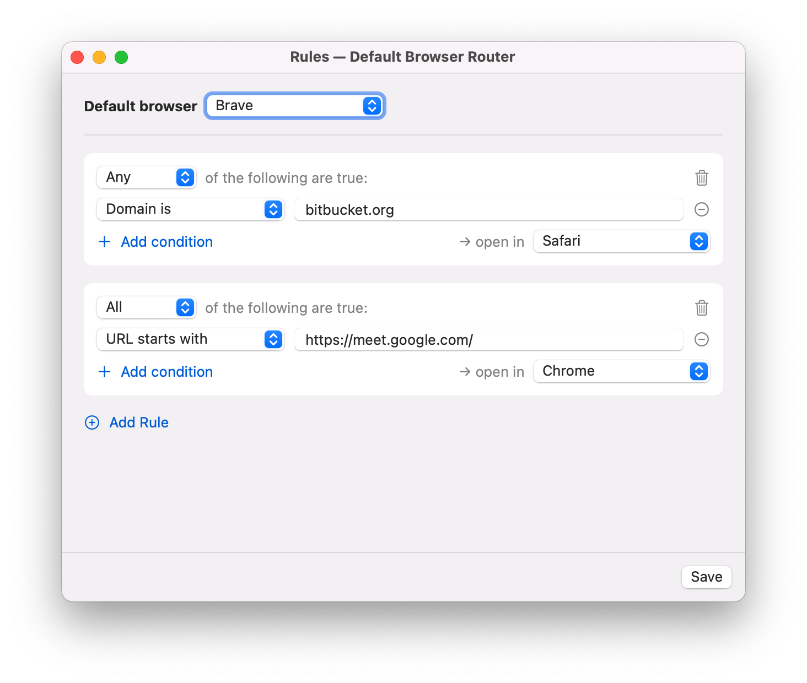

# default-browser-router

A tiny, native macOS app that registers as your **default web browser** and routes each
opened link to a different browser based on a simple YAML config — like Choosy, but
minimal, headless, and free.



## How it works

macOS sends every clicked `http`/`https` link to the one app set as the default browser.
This app *is* that app: it receives each URL, matches it against your rules (by **domain**
or **URL prefix**, first match wins), and immediately re-opens it in the target browser. A
catch-all `default` handles everything else. It runs headless with just a menu bar icon
(About / Open at Login / Quit); config is reloaded on every click, and any error falls back
to the default browser so a link is never lost.

Requires macOS 13+.

## Install with Homebrew

```bash
brew tap eugenetaranov/homebrew-tap
brew trust eugenetaranov/tap        # Homebrew requires trusting third-party taps
brew install --cask default-browser-router
```

The build is ad-hoc signed (not notarized), so clear the download quarantine once, then
launch it and make it your default browser:

```bash
xattr -dr com.apple.quarantine "/Applications/DefaultBrowserRouter.app"
open "/Applications/DefaultBrowserRouter.app"
```

On first launch it shows a "make this your default browser?" prompt — accept it (or set it
manually in **System Settings → Desktop & Dock → Default web browser**).

## Build & install locally

```bash
./scripts/bundle.sh                       # build + assemble + ad-hoc codesign
cp -R build/DefaultBrowserRouter.app /Applications/
open "/Applications/DefaultBrowserRouter.app"   # launch once, then set as default browser
```

Develop:

```bash
swift build
swift run RouterTests                     # routing/config test suite
```

## Configuration

Edit rules from the menu bar → **Edit Rules…** (a visual editor), or hand-edit the YAML at
`~/.config/default-browser-router/config.yaml` (created on first run). Both read/write the
same file; the router reloads it on every click. Note: saving from the editor rewrites the
file and drops comments.

```yaml
# First matching rule wins, top to bottom.
default: Brave

rules:
  # Simple rule: a single inline condition.
  - domain: bitbucket.org          # host or any subdomain
    browser: Safari
  - prefix: https://meet.google.com/
    browser: Chrome

  # Rich rule: combine conditions with match: all | any.
  - match: all
    conditions:
      - source_app: Mail           # the app that opened the link
      - url_contains: facebook
    browser: Safari
```

**Conditions** (each is one key): `domain` (host/subdomain), `prefix` (URL starts with),
`url_contains`, `url_equals`, `url_regex`, `source_app` (opening app by name, or bundle id
if it contains a dot). A rule is either a single inline condition, or `match: all|any` over
a `conditions:` list.

**Browsers** — `browser` and `default` accept a friendly name (`Safari`, `Firefox`, `Brave`,
`Chrome`, `Edge`, `Arc`, `Vivaldi`, `Opera`, `Chromium`) or an explicit bundle id (any value
with a dot, e.g. `com.brave.Browser`). Find one with `osascript -e 'id of app "Brave Browser"'`.
If a rule's browser isn't installed, it falls back to `default`, then Safari.
